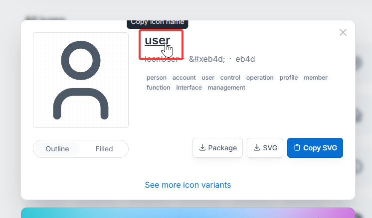

## Astroでアイコン

Nuxtにはモジュールがあります。

[https://nuxt.com/modules/icon](https://nuxt.com/modules/icon)

これと同じような感覚で使いてぇって話。

## Astro Iconを使う

[https://www.astroicon.dev/](https://www.astroicon.dev/)

これを使います。

### インストール

```shell
bun astro add astro-icon

```

これで勝手に設定までされます。

### アイコンセットのインストール

iconifyにあるものを使えます。 アイコン数と見た目を取って私はTablerを使っています。

[https://tabler.io/icons](https://tabler.io/icons)

```shell
bun add @iconify-json/tabler

```

でインストールできます。

### 使う

```astro
---
import { Icon } from "astro-icon/components";
---

<Icon name="tabler:brand-android" />
```

これでAndroidのロゴが表示されます。

## アイコンを探す

[https://tabler.io/icons](https://tabler.io/icons)

から探します。



小文字の一番目立つやつ(赤枠で囲ってるところ)をクリックします。

nameのところに`tabler:コピーした名前` とします。

## 終わり

以上です。このブログでも使っていますよ、この方法。
