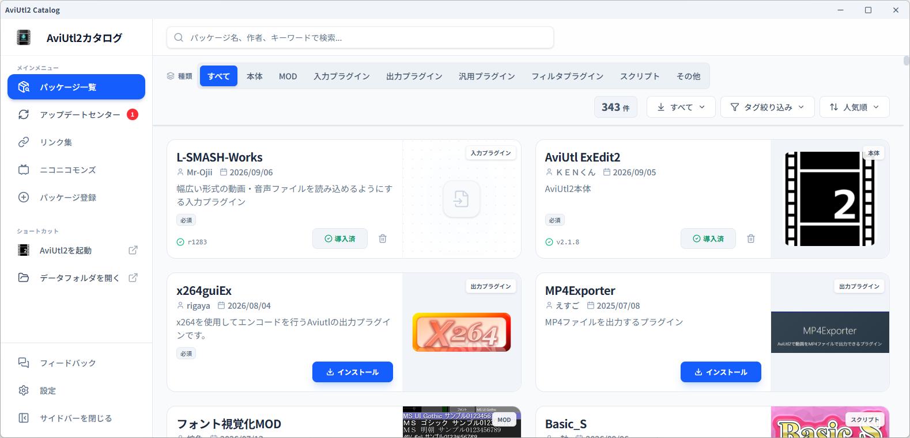
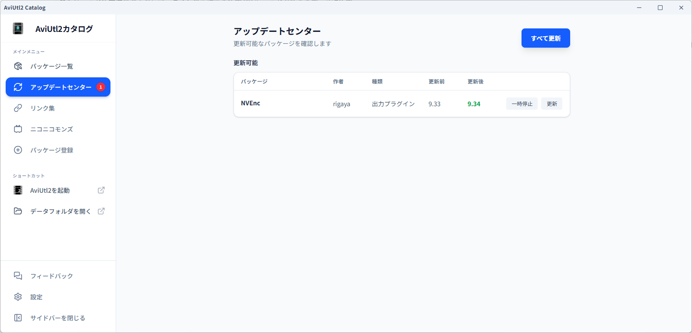
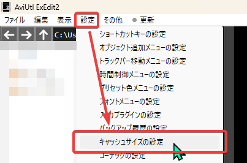
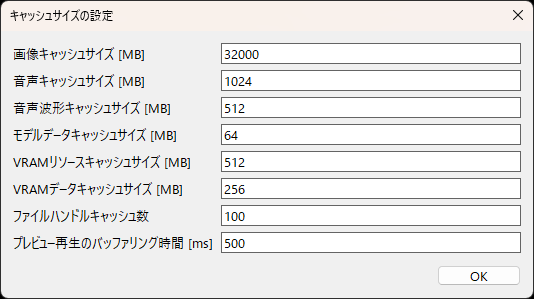
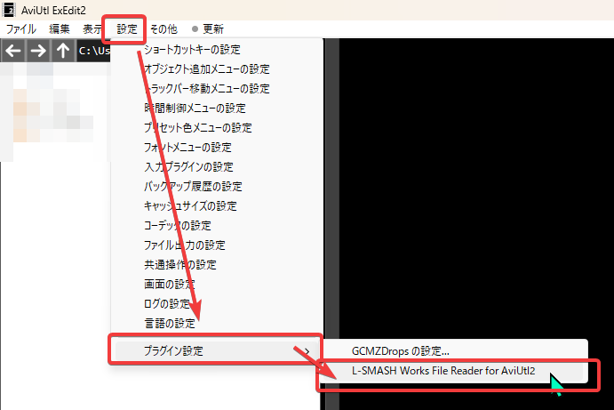
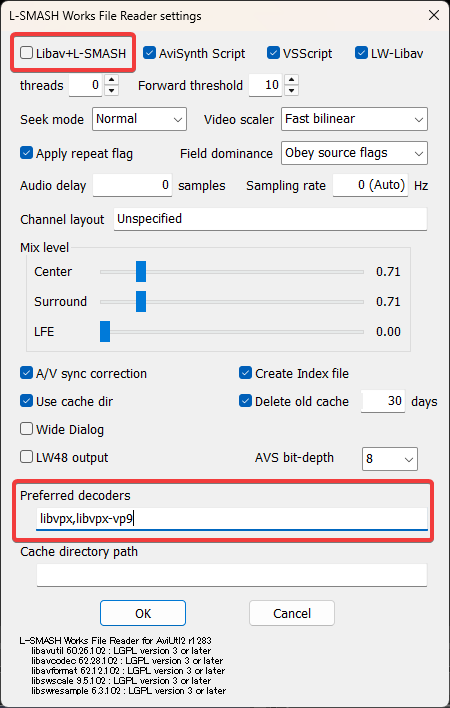
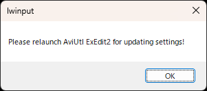
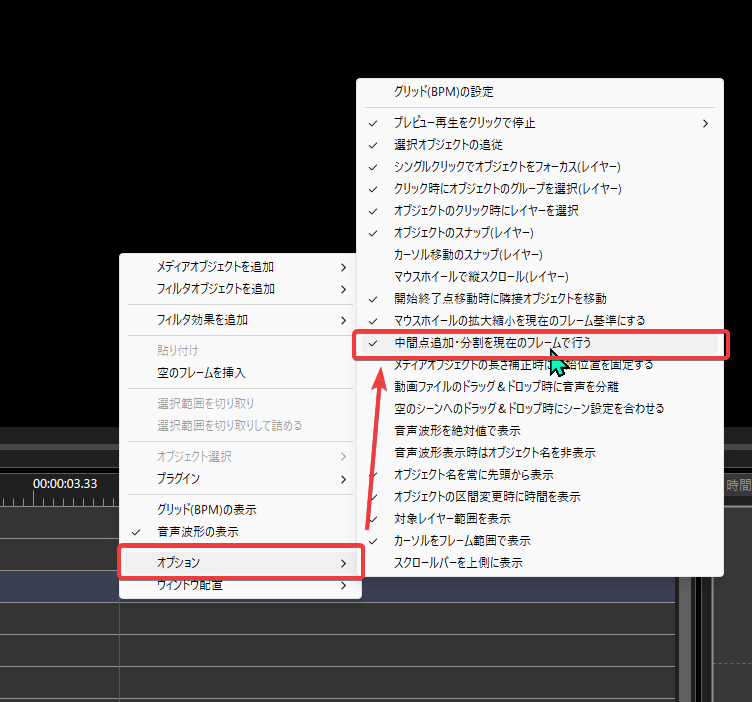

## AviUtl 2

鮮烈でしたあの出来事からしばらく経ちまして、プラグイン・スクリプト系がかなり出揃ってきましたのでメインの編集ソフトとして利用可能な感じになってきたと思います。

てことで本腰を入れて設定したのです。あんまりいじった項目は多くないですけどね。

## 管理はAviUtl2 カタログで

[https://github.com/Neosku/aviutl2-catalog](https://github.com/Neosku/aviutl2-catalog)

これを使うことで本体の導入からプラグインの管理等まですべて行うことができます。必須です。





## 入れたプラグイン・スクリプト

一部抜粋です。

### L-SMASH-Works

[https://github.com/Mr-Ojii/L-SMASH-Works-Auto-Builds](https://github.com/Mr-Ojii/L-SMASH-Works-Auto-Builds)

mp4とかを読み込むのに必要なプラグインです。

### NVEnc

[https://github.com/rigaya/NVEnc](https://github.com/rigaya/NVEnc)

NVENCによるハードウェアエンコードを行うようにするためのプラグイン。

### AutoClipping\_S

[https://github.com/sigma-axis/aviutl2\_script\_AutoClipping\_S](https://github.com/sigma-axis/aviutl2_script_AutoClipping_S)

オブジェクトの上下左右の透明領域をクリッピングするスクリプト。

他にも色々ありますが、必要そうなのはこんなものですね。

## 設定

### キャッシュの設定



設定 → キャッシュサイズの設定 を開く。



画像キャッシュをシステムメモリの半分に設定。(64GBなので32GB)\
音声キャッシュサイズを1GBに、音声波形も512MBまで盛っておく。

### L-SMASH-Worksの設定



設定 → プラグイン設定 → L-SMASH-Works File Render for AviUtl2 を開く。



**Libav+L-SMASH**のチェックを外して、Preferred decodersに

```
libvpx,libvpx-vp9
```

を追加してOK。



再起動しろってダイアログが出るので従います。

### 中間点とか分割の設定



タイムラインを右クリック → オプション → 中間点追加・分割を現在のフレームで行う にチェックを入れる

## こんなもん

現状でこんなものです。40分程度の動画素材を読み込んでも快適に編集できています。

そこそこモダンに書き直されているからか、無印よりも明らかに快適ですよね。多分。

## おわり

以上になります！
