## Jellyfin

[https://jellyfin.org/](https://jellyfin.org/)

自分の持っているメディア(テレビ番組、映画、音楽等)を管理、ストリーミングが可能です。\
すっごいわかりやすく言うと、**自分専用のストリーミングサービスを建てれる**感じです。

> **著作権について**
>
> 著作権によって保護されているコンテンツを誰でも見れる状態にすると普通に法に引っかかるので\
> 外から見れるようにする際は細心の注意を払ってくださいね。

## Dockerで構築しよう

今回はこれをDockerで構築してみようっていう記事。私の家でもDockerで動いています。

Dockerのインストールなどはすでに済んでいる前提で話を進めていきます。

## ディレクトリの作成

```shell
mkdir jellyfin
cd jellyfin
```

Jellyfin用のディレクトリを作成します。

## `compose.yml`の作成

`compose.yml`を作成します。内容は以下を参考にして下さい。

```yaml
services:
    jellyfin:
        image: jellyfin/jellyfin:latest
        container_name: jellyfin
        volumes:
            - ./config:/config
            - ./cache:/cache
            - ./media:/media
        restart: unless-stopped
        environment:
            - TZ=Asia/Tokyo
        ports:
            - "8096:8096"
```

## ディレクトリの作成

cache, config, mediaディレクトリを作成します。

```shell
mkdir -p cache config media
```

これをしないと起動時にコケます。(1敗済)

## 起動

いよいよ起動です。

```shell
docker compose up -d
```

起動したら`http://localhost:8096`にアクセスします。

アクセスするとこんな画面です。

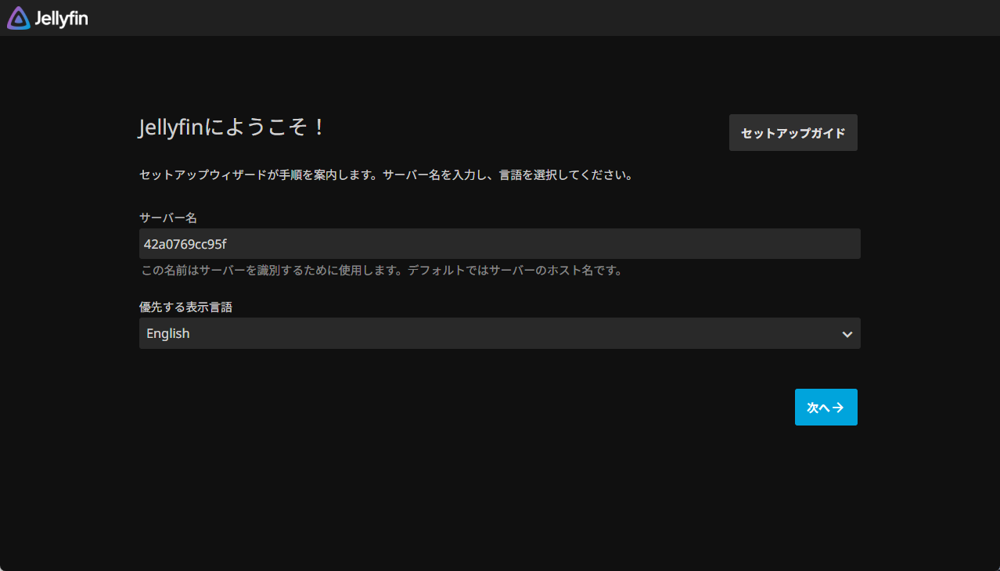

## ウィザードに沿って設定をする

### サーバー名と言語

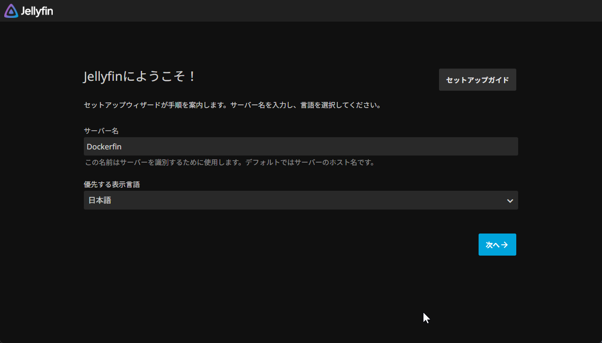

### 管理者ユーザー

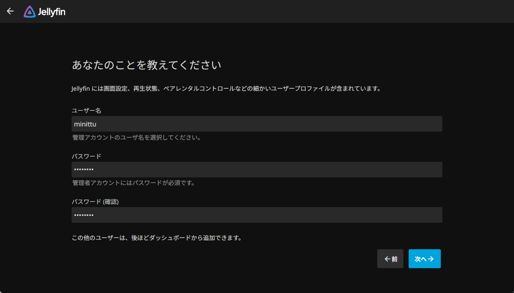

### メディアライブラリ(スキップ)

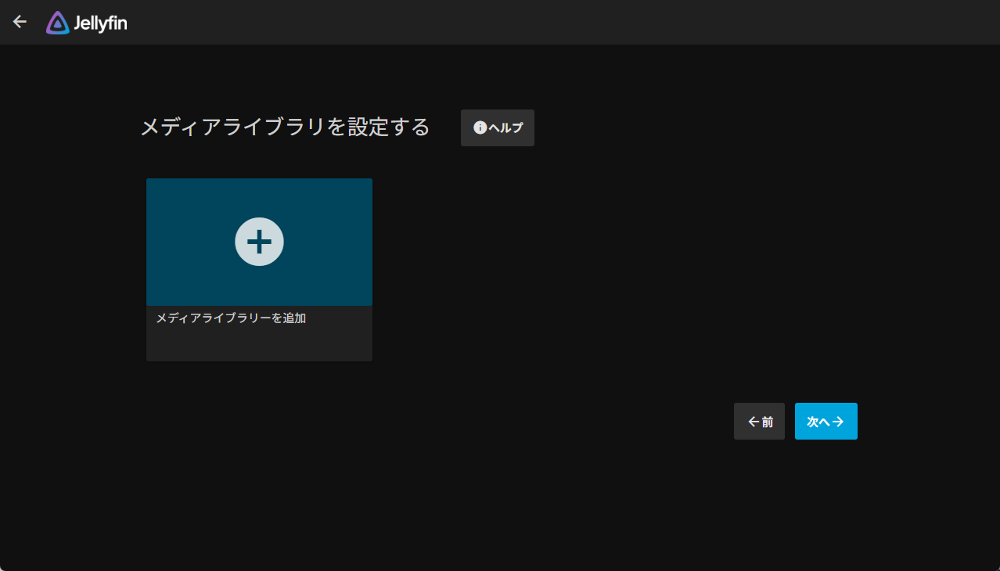

ここでは飛ばします。

### メタデータ言語

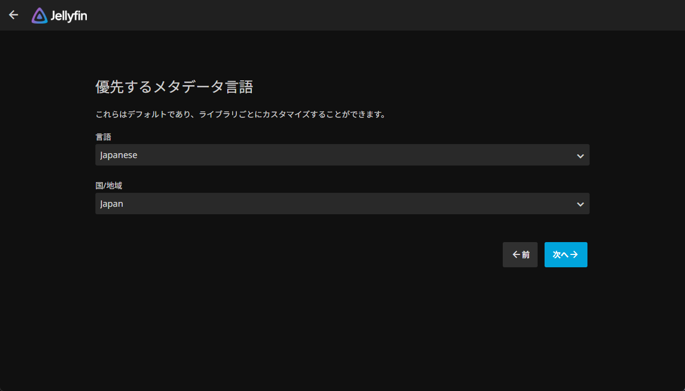

### リモートアクセスの設定

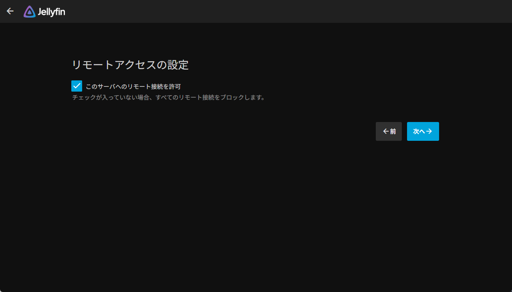

### 設定完了

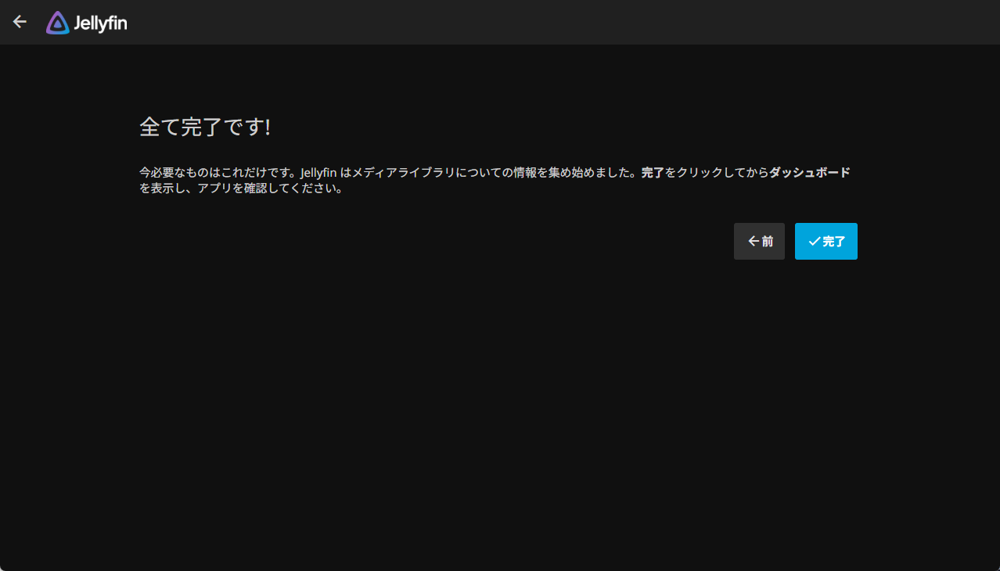

### ログイン

先ほど作成したアカウントでログインします。

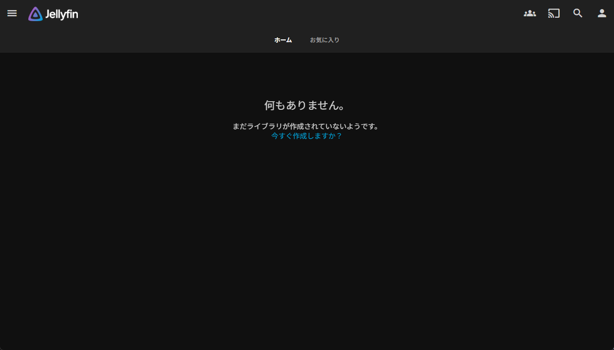

ログインするとメイン画面が出てきます。

## メディアの追加

とりあえず手持ちのメディアを移します。先ほど作成したmediaディレクトリの中に。

media内にメディアの種類でディレクトリを作るといい感じに管理できます。(例:anime,movie,music)

今回はスローループを置きました。

続いてJellyfin側でメディアライブラリの設定です。

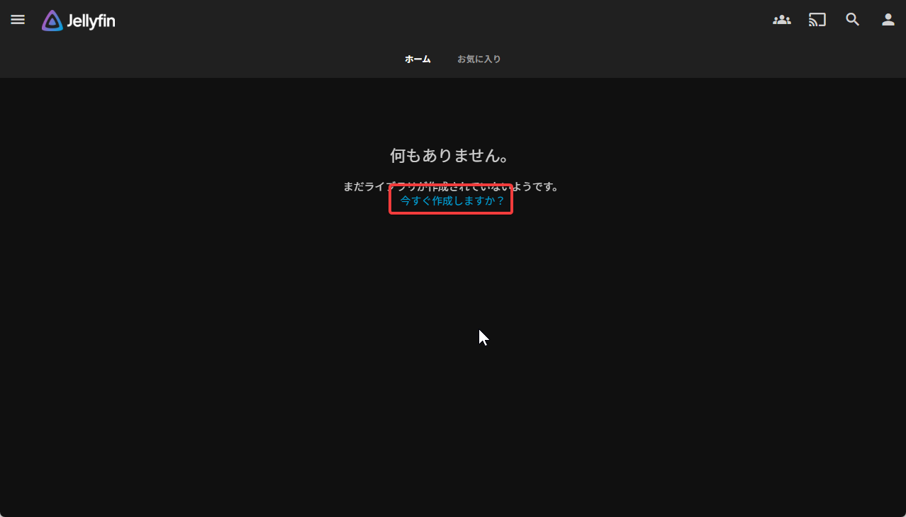

メイン画面にある「今すぐ作成しますか？」をクリック。

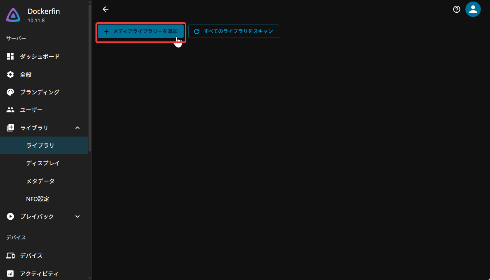

メディアライブラリーを作成 をクリック

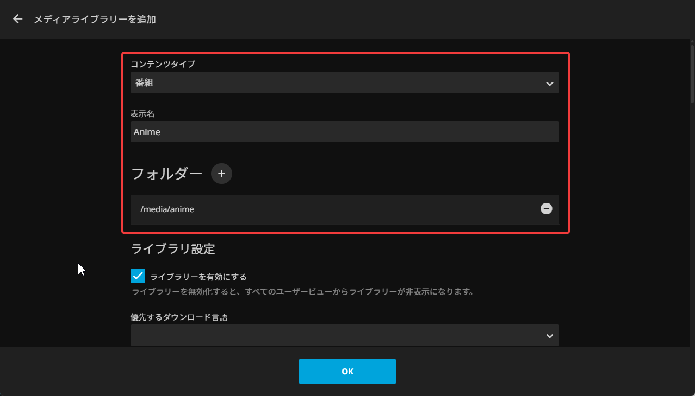

赤枠で囲ったところだけとりあえず設定します。設定したらOKをクリック。

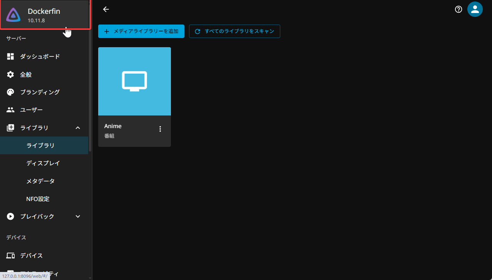

終わったらトップに戻ります。(赤枠部分をクリック)

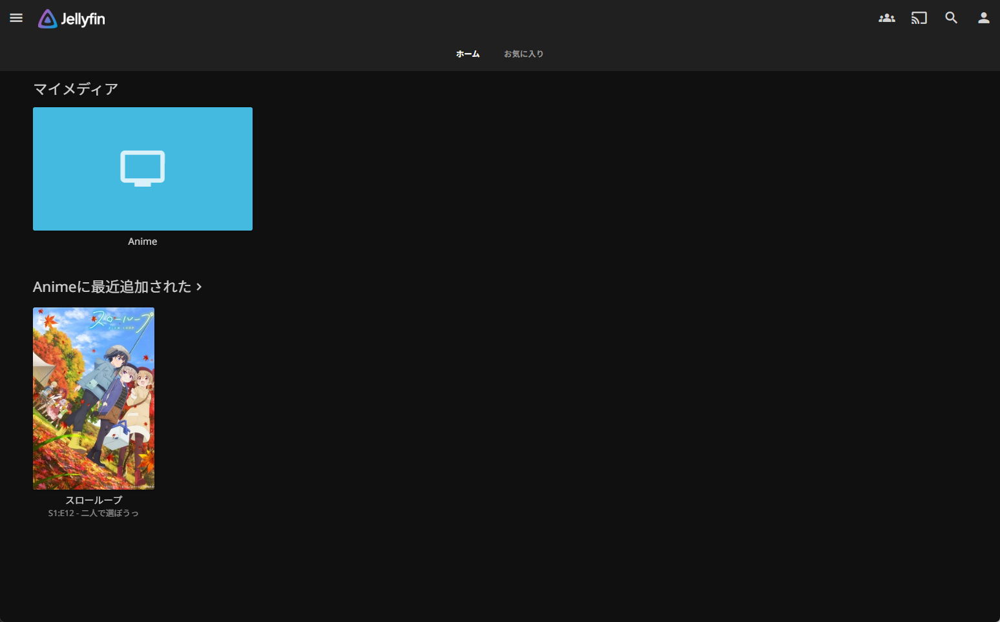

さっき追加したメディアが表示されていればOK！

## 以上!

以上になります。今回はここまで。
