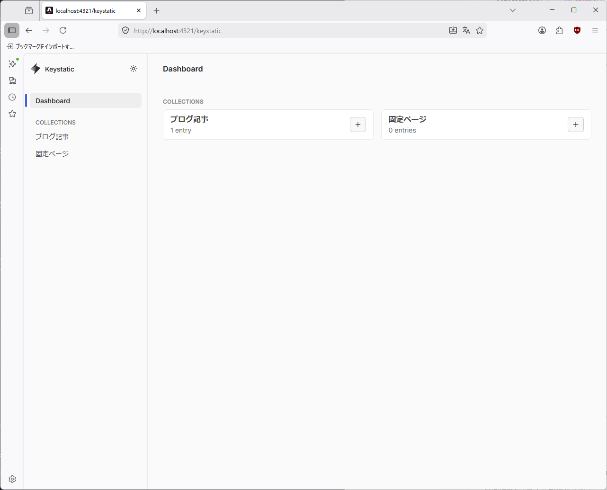
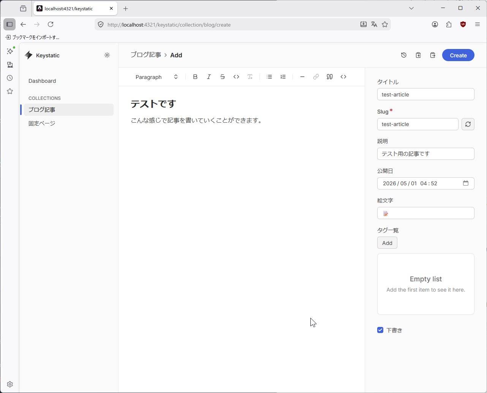
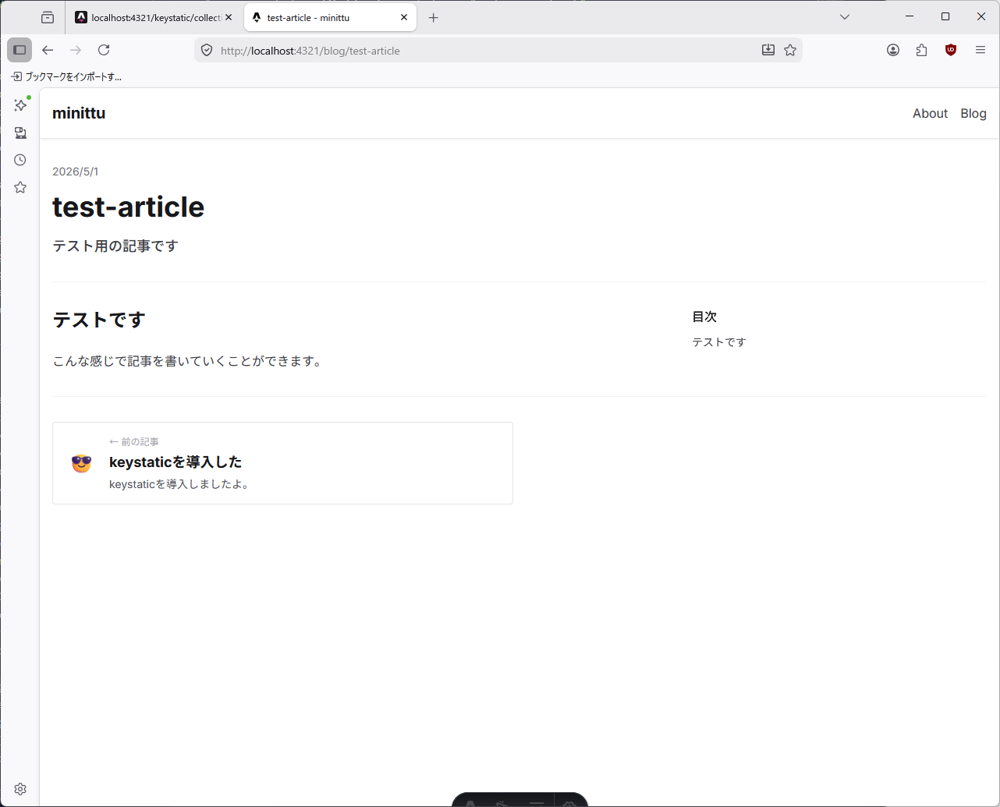

## コンテンツを楽に書きたい

こういうAstroなどの静的サイトジェネレーターを使うとどうしても課題に挙がってくるのが記事の作成などのハードルです。

VSCodeで書いてもいいんですけど、画像の貼り付けなど様々な課題が降り注ぎます。

私はこれまでヘッドレスCMSを使ってきましたが欲を言えばローカルで編集したいなって。

んで見つけました。

## Keystatic

[https://keystatic.com/](https://keystatic.com/)

既存のプロジェクトに簡単に追加できるやつです。\
この記事はKeystaticを使用して書いていますが、非常に良い。

## 導入

このサイトはAstroを使用しています。なのでAstroでの方法を。

まずインストールします。

```shell
bun astro add react
bun install @keystatic/core @keystatic/astro
```

次に`astro.config.mjs`をいじります。

```js
import keystatic from "@keystatic/astro";

export default defineConfig({
  integrations: [... keystatic(),...],
}
```

続いて設定ファイルを書いていきます。私はGeminiに`src/content.config.ts`を貼っつけて書いてもらいました。

```ts
import { config, fields, collection } from "@keystatic/core";

export default config({
    storage: {
        kind: "local",
    },
    collections: {
        blog: collection({
            label: "ブログ記事",
            slugField: "title",
            path: "content/blog/**/",
            format: { contentField: "content" },
            entryLayout: "content",
            schema: {
                title: fields.slug({ name: { label: "タイトル" } }),
                description: fields.text({ label: "説明", multiline: false }),
                date: fields.datetime({ label: "公開日", defaultValue: { kind: "now" } }),
                emoji: fields.text({ label: "絵文字", defaultValue: "😎" }),
                tags: fields.array(fields.text({ label: "タグ" }), {
                    label: "タグ一覧",
                    itemLabel: (props) => props.value,
                }),
                draft: fields.checkbox({ label: "下書き", defaultValue: false }),
                content: fields.mdx({
                    label: "本文",
                    extension: "md",
                    options: {
                        image: {
                            directory: "src/assets../../assets/images/blog/posts",
                            publicPath: "@assets../../assets/images/blog/posts/",
                            transformFilename(originalFilename) {
                                const date = new Date().toISOString().replace(/[:.]/g, "-");
                                const random = Math.random().toString(36).substring(2, 7);
                                return `${date}-${random}-${originalFilename}`;
                            },
                        },
                    },
                }),
            },
        }),
        pages: collection({
            label: "固定ページ",
            slugField: "title",
            path: "content/pages/**/",
            format: { contentField: "content" },
            entryLayout: "content",
            schema: {
                title: fields.slug({ name: { label: "タイトル" } }),
                description: fields.text({ label: "説明", multiline: false }),
                content: fields.mdx({ label: "本文", extension: "md" }),
            },
        }),
    },
});
```

スキーマに沿って当てはまるフィールドを選択していくだけですけどね。

今回はmdファイルが保存されるように。あと画像の貼り付けでファイル名が被らないようにリネームを。UUIDでも良かったかも。

## 使ってみよう

開発サーバーを起動すると`/keystatic`エンドポイントが生えてきます。そこにアクセスします。







執筆ができます。

## 日本語情報、増えて!

お前が増やすんだよ！なんて言わないでください。\
だって面倒なんですもん…。

日本語の情報が増えてほしい、英語のドキュメント読みたくない！

## おわり

今回はこのあたりで。役に立てたかな…。
