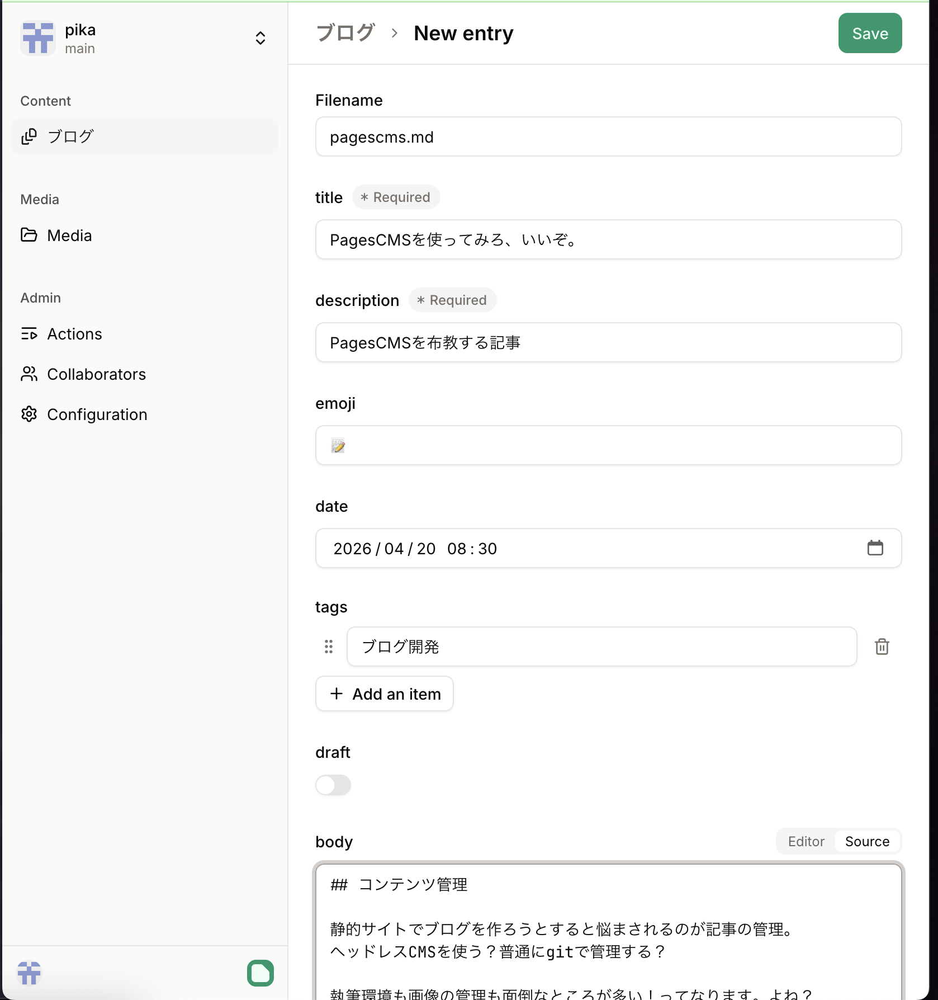

## コンテンツ管理

静的サイトでブログを作ろうとすると悩まされるのが記事の管理。
ヘッドレスCMSを使う？普通にgitで管理する？

執筆環境も画像の管理も面倒なところが多い！ってなります。よね？

## gitベースのヘッドレスCMSを使う

ヘッドレスCMSの中でもgitで管理するタイプのものを使いましょう。
このタイプのヘッドレスCMSの利点は以下の通りです。

### コンテンツが手元に残る

万が一サービス終了してもコンテンツは自分のリポジトリに残ります。
エクスポートしなくてもいいってのが楽です。

### コンテンツの編集が容易

いちいちブラウザを開かなくてもエディタで編集可能、勝手に同期もされますから楽です。

### content collectionとの連携が楽

AstroとかNuxtのコンテンツ管理系のシステムとの連携も楽です。
わざわざAPIのクライアントとかを書かなくていいし、依存関係も増えません。

みたいな感じです。

## 検討した・利用したサービス

### pitcms

[https://pitcms.net/](https://pitcms.net/)

国産のヘッドレスCMSです。
メインブログで使用しています。
画像をR2にアップロードできたり、編集セッションやレビュー機能など機能が多いです。

### PagesCMS

https://pagescms.org/

こちらのブログで使用しています。
使いやすさだとこっちの方が上だと思います。
機能は最小限ですが、個人使用ならこれで十分、シンプルなので使いやすい。

## 設定

リポジトリのルートに`.pages.yml`を作成し、以下を追記します。

```yaml
media:
    input: public/images
    output: /images

content:
    - name: blog
      label: ブログ
      type: collection
      path: content/blog
      filename:
          template: "{primary}.md"
          field: true
      delimiters: "---"
      fields:
          - name: title
            type: string
            required: true
          - name: description
            type: string
            required: true
          - name: emoji
            type: string
          - name: date
            type: date
            options:
                time: true
                format: yyyy-MM-dd'T'HH:mm
          - name: tags
            type: string
            list: true
          - name: draft
            type: boolean
            default: false
          - name: body
            type: rich-text
```

まぁ当ブログで使用しているものになりますが、、、

編集画面はこんな感じになる。



レイアウトとかを変えれるオプションもあるので、それを使えばもっと使いやすくなるんだろう。

## おわり

布教だけです。使い方とかはドキュメントを見て欲しいです(他力本願寺)
