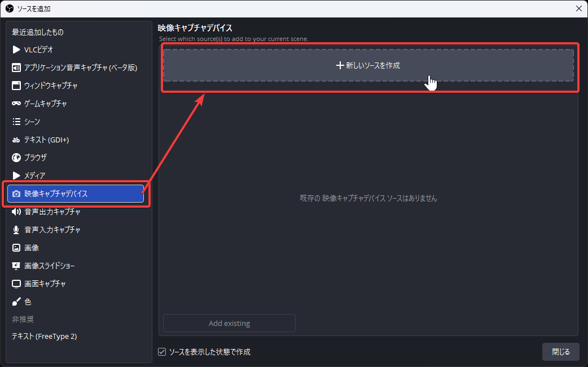
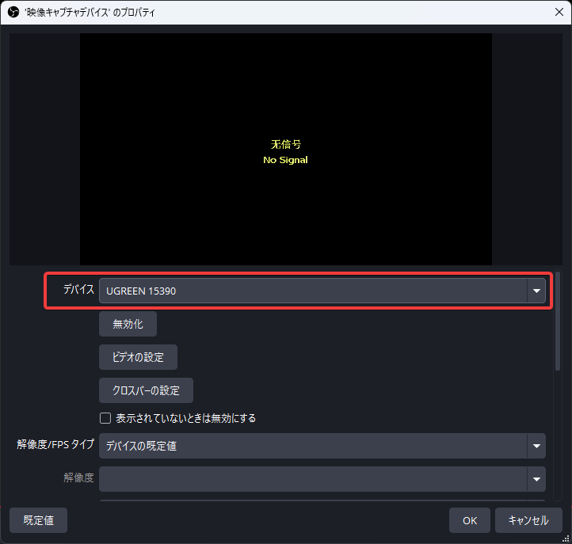
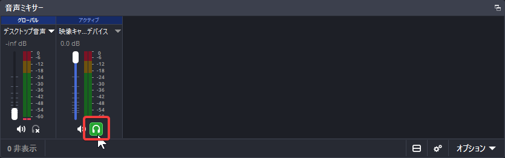

## UGREENのキャプチャーボードを買った

特にこれと言って使い道はないけれどもUGREENのキャプチャーボードを買いました。

買ったのは

[https://www.amazon.co.jp/dp/B0CM9C91MK](https://www.amazon.co.jp/dp/B0CM9C91MK)

です。(アフェリエイトリンクではありません)

この記事ではレビューではなく、OBSなどで使用する際の設定について書いていきます。

## 接続について

キャプチャーボードとパソコンはできるだけ付属のケーブルを使用し、USB 3.0以上に対応したポートに接続しましょう。

ケーブルが低品質、ポートがUSB 2.0だと性能が出ません(1敗済)

## 設定

ここではOBS Studioでの設定方法を。

### ソースを追加

「**映像キャプチャデバイス**」から「**新しいソースを作成**」を押下します。

デバイスをUGREEN 15390にします。

### ソースの設定

画像をはっつけるのが面倒なので文章だけになります。すみません！

以下のように設定します。

- **解像度/FPSタイプ:** カスタム
- **解像度:** 1920x1080
- **FPS**: 60
- **映像フォーマット**: YUV2

という感じにします。

### 音も撮りたい場合

音を取りたい場合は先ほどのプロパティの下のほうにある「**カスタム音声デバイス**」にチェックを入れ、デバイスを「**デジタルオーディオインターフェイス (UGREEN 15390)**」にします。

加えて、音をパソコンから出したい場合は、音声ミキサーのところにあるヘッドフォンマークをクリックすると聞けます。

## おわり

以上です。パススルーして映像をモニターに映せるので、遅延なくゲームを楽しめます。

使い道がないのが欠点なんですけどね。なんで買ったんだろう…。
