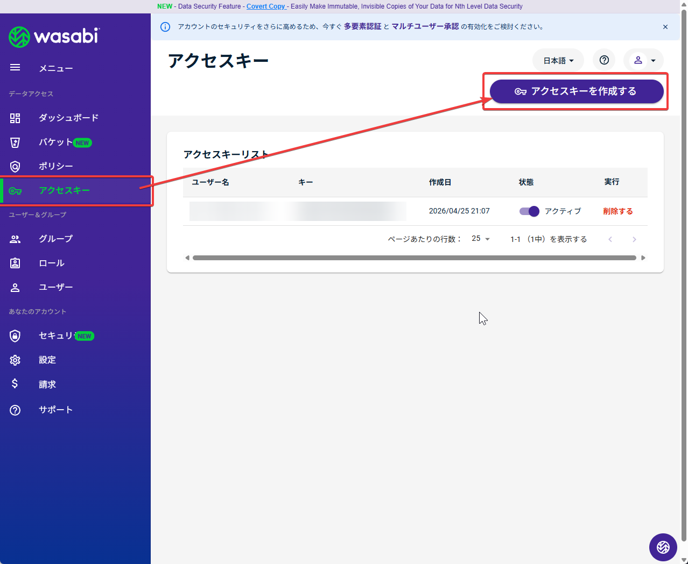
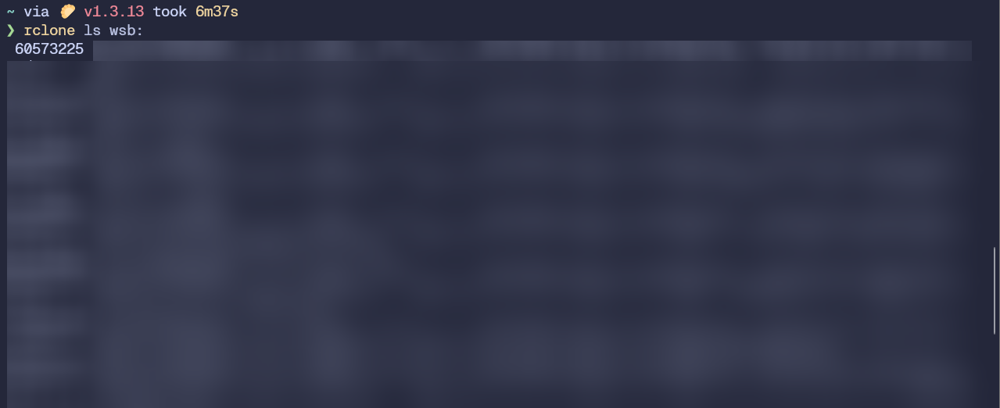

## wasabiとは

Amazon S3互換のオブジェクトストレージを提供しています。
特徴は上り下りに課金がない、容量での課金が比較的安いためいいなと思い契約。

## 使い道どうしようか?

ぶっちゃけ1TBも使えません。
Google Driveの5TBだって4GB程度しか使っていないのに。

てことで遊んでみます。

## Windowsにマウントする

Windowsにマウントしてみます。
使うのはrcloneとWinFsp

[https://rclone.org/](https://rclone.org/)

[https://winfsp.dev/](https://winfsp.dev/)

それぞれダウンロードして配置、rcloneに関してはパスを通してください。

### 設定を作成

```shell
rclone config
```

で設定ウィザードを開きます。

最初にStorageを聞かれます。これはS3を選びます。`4`を入力してEnter
次にProviderを聞かれます。これはWasabi Object Storageを選択します。`45`を入力してEnter
次にenv_authを聞かれます。これはそのままEnter
次にaccess_key_idが聞かれます。取得するために管理画面に行って



アクセスキーとシークレットを発行して、アクセスキーをはっつけてください。
続いてのsecret_access_keyも同様にはっつけます。

次にregionを聞かれます。これはそのままEnter
次にendpointを聞かれます。これはバケットのエンドポイントを指定します。tokyoなら`11`です。
location_constraint,aclはそのままEnter、advanced configもNoでOKです。
この設定でいいか？と聞かれるのでyを入力しEnter。qで設定から抜けます。

### 確認

```shell
rclone ls <設定した名前>:
```

を実行してファイルがある場合は一覧表示されます。エラーがなければOKです。



### マウントしてみる

次のコマンドでマウントできます。

```shell
rclone mount <設定した名前>:<バケット名> <ドライブレター>: --vfs-cache-mode full
```

わかりにくいので例を。

```shell
rclone mount wasabi:data W: --vfs-cache-mode full
```

これで`W:\`にマウントされました。

## 速度とか

ファイル数が多い、ファイルが大きい場合一覧表示に時間を要しますが、読み込んでからは快適です。
VFSのキャッシュ設定を凝るともう少し良くなると思いますけど、バックアップ用とかなら十分なスペックです。
比較的大きなWAVファイルもスムーズに再生可能です。

## おわり

用途をもう少し考えてから契約をすべきだ！
御尤もです。良い使い方を模索します。
